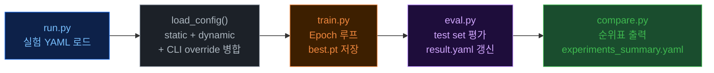
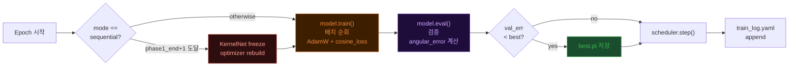
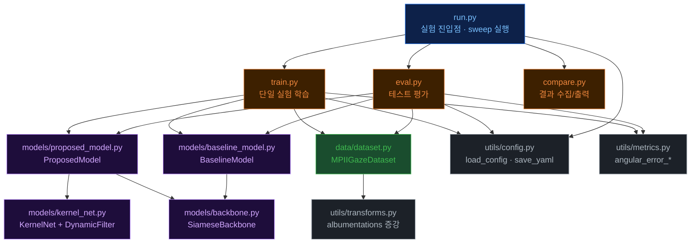
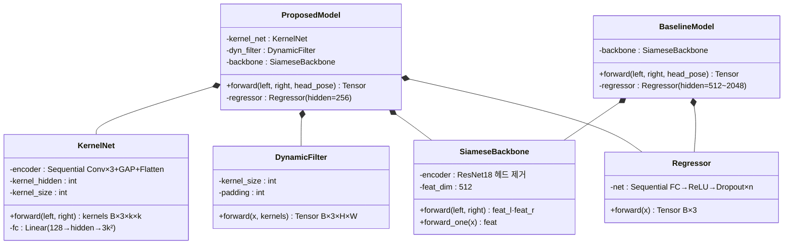
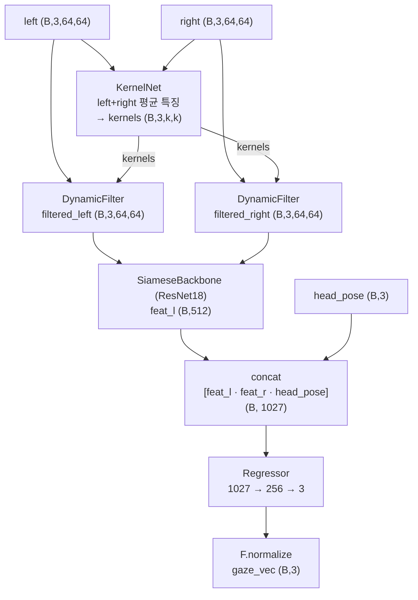
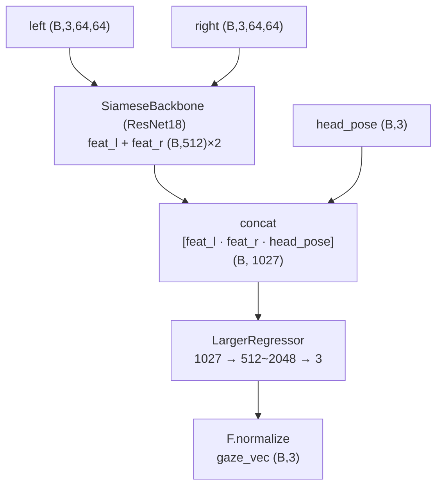

# eyetracker Reference

> **빠른 이동**:
> [🔄 실험 파이프라인](#-실험-파이프라인) ·
> [🧩 모듈 구조](#-모듈-구조) ·
> [🏗 모델 계층](#-모델-계층) ·
> [🔬 모델 아키텍처](#-모델-아키텍처) ·
> [📊 실험 설계](#-실험-설계) ·
> [🗂 데이터 구조](#-데이터-구조) ·
> [📦 모듈 상세](#-모듈-상세) ·
> [📄 파일 상세](#-파일-상세) ·
> [📖 용어 사전](#-용어-사전)

---

## 🔄 실험 파이프라인

단일 실험 (`run.py`가 자동 순서 제어):



`train.py` 내부 에폭 루프:



---

## 🧩 모듈 구조

의존 관계 (화살표 = 사용 방향):



| 파일 | 역할 | 핵심 소유 데이터 |
|------|------|----------------|
| `run.py` | sweep YAML → 실험 목록 생성, train/eval 순차 실행 | `experiments: list[dict]` |
| `train.py` | 단일 실험 학습, best.pt 저장, train_log.yaml 기록 | `model`, `optimizer`, `scheduler` |
| `eval.py` | test set 평가, param count 측정, result.yaml 갱신 | `total_params`, `kernel_params` |
| `compare.py` | runs/ 디렉토리 순회, 순위표 출력 | `results: list[dict]` |
| `proposed_model.py` | KernelNet → DynamicFilter → Backbone → Regressor | `kernel_net`, `dyn_filter`, `backbone`, `regressor` |
| `baseline_model.py` | Backbone → LargerRegressor (KernelNet 없음) | `backbone`, `regressor` |
| `kernel_net.py` | Conv 인코더로 동적 필터 커널 생성 + 적용 | `encoder` (Conv×3+GAP), `fc` (FC×2) |
| `backbone.py` | 공유 가중치 Siamese CNN (ResNet18 고정) | `encoder` (ResNet18 분류 헤드 제거) |
| `dataset.py` | HDF5 전체 RAM 로드, 증강, 정규화 | `_left_eye`, `_right_eye`, `_gaze`, `_head_pose` |
| `config.py` | static.yaml + dynamic.yaml 병합, CLI override 적용 | — |
| `metrics.py` | Angular Error (°), gaze_vec → pitch/yaw 변환 | — |

---

## 🏗 모델 계층



---

## 🔬 모델 아키텍처

### ProposedModel (실험군) 데이터 흐름



### BaselineModel (대조군) 데이터 흐름



### KernelNet 내부 구조

```
left  (B,3,64,64) ──┐
                     ├─ encoder 평균 ──→ (B,128)
right (B,3,64,64) ──┘

encoder:
  Conv(3→32, 3×3) + BN + ReLU → MaxPool(2)   # (B,32,32,32)
  Conv(32→64, 3×3) + BN + ReLU → MaxPool(2)  # (B,64,16,16)
  Conv(64→128, 3×3) + BN + ReLU → GAP        # (B,128,1,1)
  Flatten                                      # (B,128)

fc:
  Linear(128 → kernel_hidden) → ReLU
  Linear(kernel_hidden → 3 × kernel_size²)
  reshape → (B, 3, kernel_size, kernel_size)
```

### DynamicFilter — Grouped Conv 트릭

```python
# 배치별로 다른 커널을 적용하는 depthwise grouped conv
x_flat = x.reshape(1, B * C, H, W)           # (1, B*3, H, W)
k_flat = kernels.reshape(B * C, 1, k, k)     # (B*3, 1, k, k)
out    = F.conv2d(x_flat, k_flat, padding=k//2, groups=B*C)
out    = out.reshape(B, C, H, W)              # (B, 3, H, W)
```

---

## 📊 실험 설계

### 총 9개 실험

| 실험군 | 모델 | 학습 방식 | 크기 파라미터 | 실험 수 |
|--------|------|----------|--------------|---------|
| `exp_proposed_e2e_{128,512,2048}` | Proposed | E2E 50 epoch | kernel_hidden S/M/L | 3 |
| `exp_proposed_seq_{128,512,2048}` | Proposed | Sequential (20+30 epoch) | kernel_hidden S/M/L | 3 |
| `exp_baseline_{512,1024,2048}` | Baseline | E2E 50 epoch | regressor_hidden S/M/L | 3 |

### 파라미터 예산 비교

| 크기 | Proposed `kernel_hidden` | Baseline `regressor_hidden` | 추가 파라미터 |
|:----:|:------------------------:|:---------------------------:|:------------:|
| S (Small)  | 128  | 512  | ~30K  |
| M (Medium) | 512  | 1024 | ~200K |
| L (Large)  | 2048 | 2048 | ~900K |

### Sequential 학습 전략

```
Phase 1 (epoch 1 ~ 20, phase1_ratio=0.4):
  KernelNet + SiameseBackbone + Regressor 동시 학습

Phase 2 (epoch 21 ~ 50):
  kernel_net 파라미터 freeze (requires_grad=False)
  optimizer rebuild — frozen 파라미터 제외
  SiameseBackbone + Regressor만 fine-tune
```

---

## 🗂 데이터 구조

### 설정 파일 (두 YAML 병합)

| 파일 | 항목 | 설명 |
|------|------|------|
| `configs/static.yaml` | `dataset.processed_dir` | HDF5 데이터 경로 |
| | `dataset.eye_size` | 눈 이미지 크기 (64) |
| | `infrastructure.num_workers` | DataLoader 워커 수 (0 고정 — HDF5 deadlock 방지) |
| `configs/dynamic.yaml` | `model.type` | `proposed` \| `baseline` |
| | `model.kernel_hidden` | KernelNet FC 히든 (128/512/2048) |
| | `model.kernel_size` | 출력 커널 크기 (5, 홀수) |
| | `model.regressor_hidden` | Regressor 히든 (256 고정 proposed / 512~2048 baseline) |
| | `train.mode` | `e2e` \| `sequential` |
| | `train.phase1_ratio` | sequential Phase1 비율 (0.4 → 20/50 epoch) |
| | `train.epochs` | 총 에폭 (50) |
| | `train.lr` | 학습률 (1e-4) |

### 실험 디렉토리 구조

```
runs/
└── exp_proposed_e2e_512/
    ├── config.yaml       ← 병합된 전체 설정 스냅샷
    ├── train_log.yaml    ← epoch별 {epoch, lr, train_loss, val_loss, val_angular_err}
    ├── best.pt           ← 최소 val_angular_err 체크포인트
    └── result.yaml       ← 실험 메타 + 최종 결과
```

### result.yaml 포맷

```yaml
experiment:
  model_type:       proposed    # proposed | baseline
  train_mode:       e2e         # e2e | sequential
  kernel_hidden:    512         # 0이면 baseline
  regressor_hidden: 256
  total_params:     11823456
  kernel_params:    198432      # 0이면 baseline
best:
  epoch:            41
  val_angular_err:  1.68
  test_angular_err: 1.74        # eval.py 실행 후 추가
```

### HDF5 데이터셋 구조

```
data/processed/
├── train.h5   # (N_train, ...)
├── val.h5     # (N_val, ...)
└── test.h5    # (N_test, ...)

각 HDF5 키:
  left_eye   : (N, 3, H, W)  uint8   BGR 눈 이미지
  right_eye  : (N, 3, H, W)  uint8
  gaze       : (N, 3)         float32  3D 단위벡터 [x, y, z]
  head_pose  : (N, 3)         float32  MediaPipe+PnP 추정 헤드포즈
```

### 전처리 → 모델 입력 변환

```
HDF5 (3,H,W) uint8 BGR
  ↓ HorizontalFlip (학습 시 50%) — left↔right swap + gaze.x *= -1
  ↓ HWC 변환 → albumentations (회전/밝기/노이즈, 학습만)
  ↓ CHW 복원 → _normalize()
       x /= 255.0
       (B채널 - 0.406) / 0.225
       (G채널 - 0.456) / 0.224
       (R채널 - 0.485) / 0.229
  ↓ torch.Tensor (3, 64, 64) float32
```

---

## 📦 모듈 상세

<details>
<summary><strong>run.py</strong> — 실험 스윕 진입점</summary>

**파일**: `src/run.py`

| 함수 | 설명 |
|------|------|
| `_expand_sweep(sweep)` | `fixed` + `grid` Cartesian product → override 목록 |
| `_exp_name(base, overrides)` | 디렉토리 이름 생성 (`exp_{type}_{mode}_{size}`) |
| `_is_done(runs_dir, name)` | `result.yaml`에 `test_angular_err` 존재 여부 |
| `_is_trained(runs_dir, name)` | `best.pt` 존재 여부 |

```bash
python src/run.py experiments/proposed_e2e.yaml          # 실행
python src/run.py experiments/proposed_e2e.yaml --list   # 목록만
python src/run.py experiments/proposed_e2e.yaml --dry-run
python src/run.py experiments/proposed_e2e.yaml --force  # 완료 실험 재실행
```

</details>

<details>
<summary><strong>train.py</strong> — 단일 실험 학습</summary>

**파일**: `src/train.py`

| 함수 | 설명 |
|------|------|
| `_build_model(cfg)` | `model.type` 분기 → ProposedModel \| BaselineModel |
| `cosine_loss(pred, gt)` | `1 - cosine_similarity(pred, gt)` 평균, 범위 [0, 2] |
| `_build_scheduler(optimizer, cfg)` | cosine \| step \| plateau + warmup 지원 |
| `train(cfg, exp_dir)` | 전체 학습 루프, best.pt / train_log.yaml / result.yaml 생성 |

```python
# 손실 함수
loss = (1.0 - F.cosine_similarity(pred, gt, dim=1)).mean()
# → angular error의 단조 함수 → 각도 오차 직접 최소화
```

**Sequential Phase2 진입 (train 루프 내):**
```python
if train_mode == "sequential" and epoch == phase1_end + 1:
    for p in model.kernel_net.parameters():
        p.requires_grad = False
    optimizer = torch.optim.AdamW(
        filter(lambda p: p.requires_grad, model.parameters()), lr=lr, weight_decay=wd
    )
    scheduler, sched_type = _build_scheduler(optimizer, cfg)
```

</details>

<details>
<summary><strong>eval.py</strong> — 테스트셋 평가 · 파라미터 수 측정</summary>

**파일**: `src/eval.py`

| 처리 순서 | 설명 |
|----------|------|
| `config.yaml` 로드 | exp_dir에 저장된 실험 설정 사용 |
| `_build_model(cfg)` | 모델 생성 후 `total_params`, `kernel_params` 측정 |
| `best.pt` 로드 | 학습 완료 체크포인트 복원 |
| test set 추론 | `angular_error_np(preds, gts)` 계산 |
| `result.yaml` 갱신 | `total_params`, `kernel_params`, `test_angular_err` 추가 |

```python
total_params  = sum(p.numel() for p in model.parameters())
kernel_params = (
    sum(p.numel() for p in model.kernel_net.parameters())
    if hasattr(model, "kernel_net") else 0
)
```

</details>

<details>
<summary><strong>compare.py</strong> — 결과 수집 · 순위표 출력</summary>

**파일**: `src/compare.py`

`runs/exp_*/result.yaml` 전체 순회 → `test_angular_err` 기준 정렬

출력 형식:
```
순위  type       mode         size  total_params  kernel_params   val_err°  test_err°  epoch
  1  proposed   e2e          512     12,021,888        198,432    1.653°     1.714°    41
  2  baseline   e2e          1024    12,056,323              0    1.701°     1.762°    38
  ...
```

`experiments_summary.yaml` 에 `proposed_best`, `baseline_best`, `improvement_deg` 저장.

</details>

<details>
<summary><strong>MPIIGazeDataset</strong> — HDF5 데이터 로더</summary>

**파일**: `src/data/dataset.py`

- 전체 데이터를 `__init__`에서 RAM에 로드 (`num_workers=0` 필수 — HDF5 멀티프로세싱 deadlock 방지)
- ImageNet 통계 BGR 순서 정규화: `_MEAN=[0.406, 0.456, 0.485]`, `_STD=[0.225, 0.224, 0.229]`

```python
# HorizontalFlip — 수동 처리
if self.is_train and np.random.rand() < 0.5:
    left_chw, right_chw = right_chw, left_chw   # 이미지 swap
    left_chw  = left_chw[:, :, ::-1].copy()      # 픽셀 미러
    right_chw = right_chw[:, :, ::-1].copy()
    gaze[0] *= -1.0                              # x성분 부호 반전
```

`__getitem__` 반환:
```python
{"left": Tensor(3,64,64), "right": Tensor(3,64,64),
 "gaze": Tensor(3,), "head_pose": Tensor(3,)}
```

</details>

<details>
<summary><strong>SiameseBackbone</strong> — 공유 가중치 CNN</summary>

**파일**: `src/models/backbone.py`

ResNet18의 분류 헤드(`fc` 레이어)를 제거하고 AdaptiveAvgPool2d 출력을 특징으로 사용.

| backbone | feat_dim | 파라미터 |
|----------|----------|---------|
| resnet18 | 512 | ~11.2M |
| mobilenet_v2 | 1280 | ~3.4M |

```python
# resnet18 — 분류 헤드 제거
base = tvm.resnet18(weights="IMAGENET1K_V1")
self.encoder = nn.Sequential(*list(base.children())[:-1])  # (B,512,1,1)
```

좌/우 눈에 **동일한 가중치** 공유 (`forward_one` 두 번 호출):
```python
def forward(self, left, right):
    return self.forward_one(left), self.forward_one(right)  # (B,512), (B,512)
```

</details>

<details>
<summary><strong>config.py</strong> — YAML 병합 · CLI override</summary>

**파일**: `src/utils/config.py`

`load_config(config_dir, overrides)`:
1. `static.yaml` 로드
2. `dynamic.yaml` 로드 → deep merge
3. CLI `--set key=value` 형식 override 적용 (점 표기법 지원: `model.kernel_hidden=128`)

실험 시작 시 병합된 전체 설정을 `exp_dir/config.yaml`로 저장 (재현성 보장).

</details>

---

## 📄 파일 상세

<details>
<summary><code>experiments/proposed_e2e.yaml</code> — 실험군 E2E 스윕</summary>

```yaml
name: proposed_e2e
description: "실험군 — End-to-End 학습, KernelNet 크기 S/M/L"
sweep:
  fixed:
    model.type: proposed
    train.mode: e2e
  grid:
    model.kernel_hidden: [128, 512, 2048]
```

생성 실험: `exp_proposed_e2e_128`, `exp_proposed_e2e_512`, `exp_proposed_e2e_2048`

</details>

<details>
<summary><code>experiments/proposed_seq.yaml</code> — 실험군 Sequential 스윕</summary>

```yaml
name: proposed_seq
description: "실험군 — 순차 학습 (Phase1→Phase2), KernelNet 크기 S/M/L"
sweep:
  fixed:
    model.type: proposed
    train.mode: sequential
    train.phase1_ratio: 0.4
  grid:
    model.kernel_hidden: [128, 512, 2048]
```

생성 실험: `exp_proposed_seq_128`, `exp_proposed_seq_512`, `exp_proposed_seq_2048`

</details>

<details>
<summary><code>experiments/baseline.yaml</code> — 대조군 스윕</summary>

```yaml
name: baseline
description: "대조군 — E2E, 파라미터 매칭 Regressor (KernelNet 없음)"
sweep:
  fixed:
    model.type: baseline
    train.mode: e2e
  grid:
    model.regressor_hidden: [512, 1024, 2048]
```

생성 실험: `exp_baseline_512`, `exp_baseline_1024`, `exp_baseline_2048`

</details>

<details>
<summary><code>src/models/kernel_net.py</code> — KernelNet · DynamicFilter 핵심</summary>

```python
# KernelNet.forward — 좌우 평균 특징으로 대칭 필터 보장
feat = (self.encoder(left) + self.encoder(right)) / 2.0  # (B,128)
k    = self.fc(feat)                                       # (B, 3*k²)
return k.reshape(-1, 3, self.kernel_size, self.kernel_size)

# DynamicFilter.forward — Grouped Conv 트릭
B, C, H, W = x.shape
x_flat = x.reshape(1, B * C, H, W)
k_flat = kernels.reshape(B * C, 1, k, k)
out    = F.conv2d(x_flat, k_flat, padding=self.padding, groups=B * C)
return out.reshape(B, C, H, W)
```

</details>

<details>
<summary><code>src/utils/metrics.py</code> — Angular Error · Pitch/Yaw 변환</summary>

```python
# Angular Error (핵심 평가 지표)
dot = np.clip(np.sum(pred * gt, axis=1), -1.0, 1.0)
angular_error = np.mean(np.degrees(np.arccos(dot)))  # degrees

# MPIIGaze 좌표계 → pitch/yaw (표시 목적)
# x=오른쪽, y=아래, z=카메라 반대
pitch = np.arcsin(-gvec[..., 1])           # 위↑ = 양수
yaw   = np.arctan2(-gvec[..., 0], -gvec[..., 2])  # 오른쪽→ = 양수
```

</details>

<details>
<summary><code>src/infer.py</code> — 실시간 웹캠 추론</summary>

```python
# 추론 흐름 (매 프레임)
frame = cap.read()
det_result = landmarker.detect(frame)      # 원본 frame 직접 입력
l_crop = frame[y1:y2, x1:x2]              # 눈 영역 크롭
l_t    = _prepare_eye(l_crop, eye_size)   # resize → normalize
gvec   = model(l_t, r_t, hp_t)            # (1,3) 단위벡터
pitchyaw = gaze_vec_to_pitchyaw(gvec)     # 화살표 표시용
```

**주의**: `apply_det`, `apply_pose`, `apply_crop` 완전 제거 — MediaPipe는 원본 프레임에 직접 실행.

</details>

---

## 📖 용어 사전

| 용어 | 한 줄 설명 |
|------|-----------|
| **Angular Error** | 예측/정답 단위벡터 사이 각도(°) — `arccos(dot(pred, gt)) × 180/π` |
| **Cosine Loss** | `1 - dot(pred_unit, gt_unit)` — angular error의 단조 함수, 범위 [0,2] |
| **KernelNet** | 눈 이미지 → 채널별 depthwise 커널 (B,3,k,k) 생성하는 작은 CNN |
| **DynamicFilter** | 배치마다 다른 커널 적용 — Grouped Conv 트릭으로 구현 |
| **SiameseBackbone** | 좌/우 눈을 **동일 가중치** CNN에 통과시켜 특징 추출 |
| **Proposed** | 실험군 — KernelNet+DynamicFilter로 입력 전처리 후 소형 Regressor |
| **Baseline** | 대조군 — 전처리 없이 동일 파라미터 예산을 Regressor 크기에 투자 |
| **E2E** | End-to-End — 50 epoch 전체를 모든 파라미터 동시 학습 |
| **Sequential** | Phase1(20 epoch 전체 학습) → Phase2(KernelNet freeze, Estimator fine-tune) |
| **kernel_hidden** | KernelNet FC 히든 크기 — S=128/M=512/L=2048 파라미터 예산 조절 |
| **regressor_hidden** | Baseline Regressor 히든 크기 — S=512/M=1024/L=2048 |
| **HorizontalFlip** | 수동 증강 — 좌우 이미지 swap + 픽셀 미러 + gaze.x 부호 반전 |
| **3D 단위벡터** | 모델 출력 — (x,y,z) MPIIGaze 좌표계 (x=오른쪽, y=아래, z=카메라 반대) |
| **num_workers=0** | HDF5 파일을 멀티프로세스로 열면 deadlock → 워커 0개 고정 |
| **total_params** | eval.py가 측정하는 모델 전체 파라미터 수 |
| **kernel_params** | eval.py가 측정하는 KernelNet 파라미터 수 (baseline=0) |
| **sweep** | 실험 YAML의 fixed + grid Cartesian product 전체 실험 목록 |
| **phase1_ratio** | sequential 전용 — Phase1에 할당할 epoch 비율 (0.4 = 50×0.4 = 20 epoch) |

<details>
<summary><strong>Cosine Loss vs Angular Error</strong> — 왜 다른가</summary>

| | Cosine Loss | Angular Error |
|---|---|---|
| **역할** | 학습 목적 함수 | 평가 지표 |
| **수식** | `1 - dot(pred, gt)` | `arccos(dot(pred, gt)) × 180/π` |
| **단위** | 무단위 [0, 2] | 도(°) |
| **역전파** | ✅ 가능 | ❌ arccos 불연속성 |
| **관계** | 단조 함수 — cosine loss 최소화 ↔ angular error 최소화 |

```python
# train.py: cosine loss 최적화
loss = (1.0 - F.cosine_similarity(pred, gt, dim=1)).mean()

# eval.py: angular error 보고
dot = np.clip(np.sum(pred * gt, axis=1), -1.0, 1.0)
err = np.mean(np.degrees(np.arccos(dot)))
```

</details>

<details>
<summary><strong>파라미터 예산 설계</strong> — Proposed vs Baseline 공정 비교</summary>

SiameseBackbone(ResNet18, 11.2M)은 양쪽 고정. 추가 파라미터만 비교.

```
Proposed:  KernelNet(extra_params) + Regressor(256 hidden, 소형)
Baseline:  Regressor(512~2048 hidden, extra_params에 해당하는 크기)
```

**핵심 질문**: 동일 파라미터 예산을 필터링(KernelNet)에 쓰는 게 유리한가, 추정기(Regressor)에 쓰는 게 유리한가?

`eval.py`가 실제 파라미터 수를 측정해 `result.yaml`에 기록 → `compare.py`에서 공정 비교.

</details>

<details>
<summary><strong>HorizontalFlip 수동 구현 이유</strong></summary>

MPIIGaze는 좌우안 이미지가 **독립적으로 존재** (단일 이미지 flip이 아님).
좌우 반전 시:
1. `left_eye` ↔ `right_eye` **이미지 자체를 swap**
2. 각 이미지를 픽셀 수평 미러 (`[:, :, ::-1]`)
3. `gaze[0] *= -1.0` — 시선 벡터 x성분 부호 반전 (MPIIGaze 좌표계: x=오른쪽)

albumentations의 HorizontalFlip은 단일 이미지만 처리하므로 이 로직을 대체할 수 없음.

</details>
